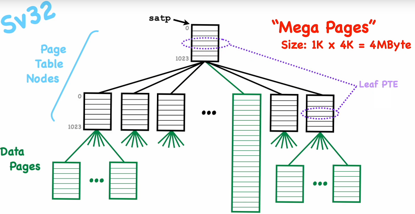

# Virtual Memory
Created Samstag 15 März 2025

Virtual pages to Physical pages
-------------------------------

Page table
----------

Address mapping
---------------
This concept based on RISC-V [Sv32](#Concepts:CPU:Virtual Memory#sv32). Besides the hw details, it should be the same with other architectures but with less legacy baggage.
### E.g. RISC-V opitions
#### RV32 (32-bit CPUs)

* No mapping (paging turned off)
* [Sv32](#Concepts:CPU:Virtual Memory#sv32): 32-bit virtual address -> 34-bit physical address (e.g. 16 GiB RAM) -> 2-level trees

#### RV64 (64-bit CPUs)

* No mapping (paging turned off)
* Sv39: 39-bit virtual address -> 56-bit physical address (e.g. 0.5 TiB RAM) -> 3-level trees
* Sv48: 48-bit virtual address -> 56-bit physical address (e.g. 256 TiB RAM) -> 4-level trees
* Sv57: 57-bit virtual address -> 56-bit physical address (e.g. 128 PiB RAM) -> 5-level trees

### For each address space
A Mapping is like a function which translates the virtual address into a physical address with some protection bits:
``f(virtAddr) -> physAddr, R/W/X/V/U``
Hardware uses this mapping on every LOAD, STORE or FETCH instruction.
### Implementation: Page Table
A data sturcture im physical memory. Hardware reads this data structure on every memory access.
#### Optimization
Translation Lookaside Buffers (TLB): Cache of important recentl-used entries.
#### Protection bits
R/W/X	Read/Write/Execute, Each page has priviliges which allows one of the commands LOAD, STORE or FETCH -> *page faults* if the wrong access is used.
V	Is page valid (in use, in phys. memory)? ->  page faults (invalid = unmapped pages)
U	Is this a User page or a Supervisor page? -> page faults
U = 0 -> Supervisor page
U-mode: 
Normally applications run in User mode.
access U page -> OK, access S page -> page faults
S-mode: access S page -> OK, access U page -> page faults
Kernel runs in Supervisor mode.
To give access (e.g. data to/from User pages by supervisor code) there is a status register *sstatus*. SUM bilts allow LOAD/STORE operations.
Pages
-----
Each page is 4 KBytes (2^12^ = 4096).
Pages are aligned on 4k boundaries (memory addresses).
Offset into page: Low-order 12 bits
Upper bits of address: Page number
### Address

### Page table
Maps virtual page number to physical page number. The offset is unchanged.
Sv32
----
### Physical addreses

Physical memory addresses:	34 bits
Number of pages:		2^22^ = 4M
Number of bytes per page:	4K
Max Physical addresses:		2^22^ x 2^12^ = 4M x 4K = 16 GiB
### Mappings
The mappings data structure will be done with keys (ordered set of integers) to values (integers) organized into a [Radix Tree](../../Glossary/Radix_Tree.md). Sv32 uses Two-level-tree. Each node points to 1024 (2^10^) childern (= physical page number ) PTE: Page Table Entry, 1M x 4K = 4 GiB). 

#### satp register Sv32
CPU register 32 bit, **S**upervisor **A**ddress **T**ranslation and **P**rotection

Mode:	 1bit, 0 = Enable 32bit (Sv32) page-based virtual addresssing, 1 = Enables paging -> all 32bits need to be 0 to disable paging. 
ASID:	 9bit, **A**ddress **S**pace **I**dentifier
PPN:	22bit, Physical page number (PPN, physical address devided by 4KiB) of the MMU mapping tree root node.
-> In Sv39, Sv48, and Sv57 (64bit CPUs) it is 64bit wide
#### Page table
Each page table entry points to an array[1024] of [PTE](../../Glossary/PTE.md)s (4 bytes).

Gray pages are not used. Access them would lead to a page fault.
#### Page table entry (PTE)

PTE entries for the interior page/node looks has the **RWX** bits (flags) set to **0**
else Leaf page
If **W**, then **R** must also be set
else Page Fault exception
If LOAD statment, then **R** must be 1
else Load Page Fault exception
If STORE/[AMO,](../../Glossary/AMO.md) then **W** must be 1
else Store/AMO Page Fault exception
If FETCH, then **X** must be set 1
else Instruction Page Fault exception

### Virtual Addresses

Virtual memory addresses:	32 bits
Number of pages:		2^20^ = 1M
Number of bytes per page:	4K
Virtual space size:		2^20^ x 2^12^ = 1M x 4K = 4 GiB

### Mapping procedure

1. Read **satp** CPU register to get [PPN](../../Glossary/PPN.md) * 4KiB to get physical address of the **root (interior) node** of the mapping tree.
2. Read the **VPN 1** (index of the root node) of the virtual address add it to the phy. address of the root node to get the address to the corresponding [PTE](../../Glossary/PTE.md).
3. Check if the page is valid (mapped to an physical address page ). Read the [PTE](../../Glossary/PTE.md) to get the **22 bit page number * 4KiB** to get the **physical address** to the **leaf node**.
4. Read the **VPN 2** (index of the leaf node) of the virtual address add it to the phy. address of the root node to get the address to the corresponding [PTE](../../Glossary/PTE.md).
5. **Check** the **privilege bits** (RWXUV). If the page is valid and the requested access does NOT differ otherwise a page fault. Read the [PTE](../../Glossary/PTE.md) to get the **22 bit page number * 4KiB** to get the **physical address** to the **data node**. . 
6. Calculate physical address by **22 bit page number * 4KiB**  and add the **offset (12 bit)** from the **virtual address**. 

#### Functional description

1. address <- satp[PPN]*4
2. pte -> memory [address + virtAddr[VPN_1]*4]. 
3. If **pte** is not VALID, cause **page fault exception**. address <- pte[PPN]*4096 (a <- pte[PPN] « 12)
4. pte -> memory [address + virtAddr[VPN_2]*4]. 
5. If **pte** is not VALID, cause **page fault exception**. if pte[A] is clear, then set it. If pte[D] is clear and this is a write, then set it.
6. phyAddr -> pte[PPN]*4096 + virtAddr[OFFSET]

### Mega pages
Size:		1KiB*4KiB = **4MiB**
Addvantages:	

* Reduces size of the page table
* Reduces [TLB](../../Glossary/TLB.md) usage

A **Mega Page** is a big data consisting of all data page (1024 pages) of a leaf page
 merged to one data page and without a leaf entry directly managed by the root node PTE.
#### Physical address of a Mega Page

