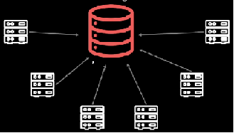

# NoSQL
Created Freitag 01 November 2019

To embed or not to embed data
-----------------------------
Questions to ask:

1. Is the embedded data wanted **80% of the time**?
2. How often do you want the embedded data **without the containing document**?
3. (Is the embedded data a bounded set?)
4. Is the bounded data **small**?
5. **How varied** are your queries? -> How often do you need the embedded data?
6. Is this an *integration DB* or an application DB?
	1. integration DB: Some **central store** for data for diffrent apllications e.g. address DB -> data sharing

