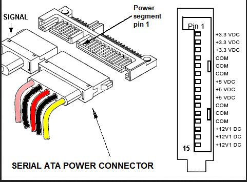

# PWDIS
Created Dienstag 07 Januar 2020

= power disable

This feature utilizes the third pin (P3) of the SATA connector.
According to the newer SATA specs, P3 is now independent and transfers the power disable signal.
 

