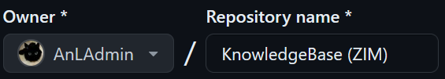

# Create empty repository
Created Sonntag 19 Mai 2024

On your Github dashboard click NEW. 
Enter a repository name.

Set a description (if you like).
Set public or private.

Optional
Add a README if you want to have more information on the repositorys home page.
Create a default .gitignore file based on a template.
Choose a license.

Create the repository.

