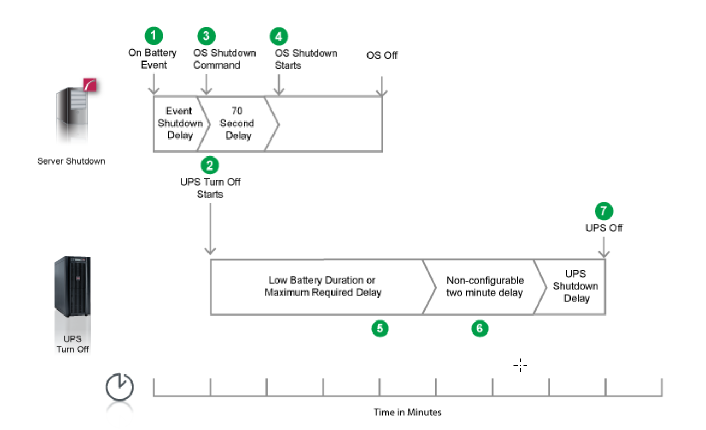

# Example 1
Created Samstag 20 November 2021

Turn of UPS enabled, No shutdown command file configured.

The option to Turn off the UPS is enabled on the Shutdown settings page. No shutdown command file is configured.
When a critical UPS event, such as On Battery occurs, the following sequence is triggered.

1. PowerChute reports that the UPS is on battery.
2. After the shutdown delay configured for the On Battery event has elapsed, PowerChute sends a command to

turn off the UPS.

3. PowerChute starts the operating system shutdown sequence.
4. After a 70 second delay the operating system starts to shut down.
5. The UPS will wait the amount of time indicated by one of the following, whichever is greater: Low Battery

Duration or Maximum Required Delay
These are shown on the UPS Shutdown page in the NMC UI.

6. After this delay, a further non-configurable two minute delay is counted down.
7. The UPS will then turn off after the user-configurable Shutdown Delay time has elapsed

This is configurable on the UPS Shutdown page in the NMC UI.
It is recommended that the Low Battery Duration is configured to allow enough time for the Operating System
shutdown to complete. Ideally the operating system should have shut down before the non-configurable two minute
delay (step 6) starts to count down.

