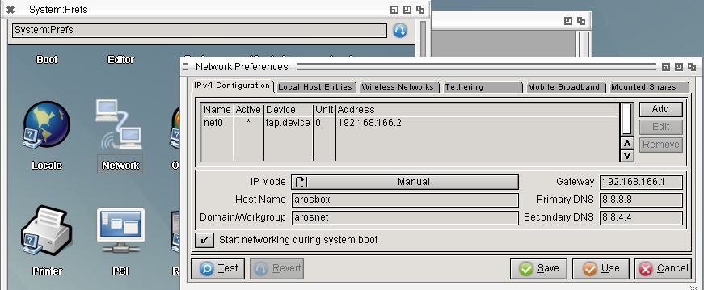

# Linux-hosted-x86-64
Created Mittwoch 02 April 2025


* ☐ AROS dev: Extend **lh_startaros.sh** to restore/save AROS prefs. !!!


Setup
-----
This setups a Linux hosted x86 64 bit AROS.
### Create/compile
To start first **Linux-hosted** AROS x86 64 bit build start again:
``$ ./AROS/scripts/rebuild.sh``

Choose **2) core-linux-x86_64 (DEBUG)**.
Creates content in **aros/arosbuilds/core-linux-x86_64-d**.

### First start
Once the operation is complete, AROS is already installed. You can run it by executing the AROSBootstrap file. But no network at this moment.
``$ cd core-linux-x86_64-d/bin/linux-x86_64/AROS``
``$ ./boot/linux/AROSBootstrap``

### Shutdown wsl
Because networking (routing) didn't work correctly I shutdown WSL which worked. Could have been a one time thing but just to be sure. Exit the Ubuntu console and execute the command on Powershell or CMD (Does not need admin):
``$ wsl --shutdown``

### Create a startup script
To have an easier way to start up AROS create the following script **~/development/aros/scripts/lh_startaros.sh**:
WSL 2 Ubuntu 24.04: ``# apt install iptables``
```sh
#!/bin/bash

# Check if the network interface aros0 exists
if ! ip link show aros0 &>/dev/null; then
    echo "Installing bridge network... (sudo access required)"
    
    # Create a TAP interface with standard Ubuntu command
    sudo ip tuntap add dev aros0 mode tap user "$USER"
    
    # Assign an IP address to the TAP interface
    sudo ip addr add 192.168.166.1/24 dev aros0
    sudo ip link set aros0 up
    
    # Enable NAT for both eth0 and wlan0
    sudo iptables -t nat -A POSTROUTING -o eth0 -s 192.168.166.0/24 -j MASQUERADE
    sudo iptables -t nat -A POSTROUTING -o wlan0 -s 192.168.166.0/24 -j MASQUERADE
    
    # Enable IP forwarding
    echo 1 | sudo tee /proc/sys/net/ipv4/ip_forward
fi

# Navigate to the project directory and start AROS
cd ~/development/arosbuilds/core-linux-x86_64-d/bin/linux-x86_64/AROS || exit
./boot/linux/AROSBootstrap -m 1024

```
This script gives AROS a TAP as network card and routes the traffic into the LAN/Internet and starts AROS.
Set execution bit:
``$ chmod 755`` **``~/development/aros/scripts/lh_startaros.sh``**
Add **${HOME}/development/aros/scripts** to the path in **~/.bashrc**:
```sh
export PATH=$PATH:~/development/aros/scripts
```
Execute the command above also in the console or restart/relogin to the console or execute **``. ~/.bashrc``**.

Start AROS with:
``$ lh_startaros.sh``

In AROS open **Prefs/Network**, select the **tap.device** interface and manually set the IP addresses as in the following screenshot:


### Prepare cross compiler
This creates a shortcut to directly run the AROS cross compiler to create AROS binaries.
Create a script **x86_64-aros-gcc** in **~/development/aros/arosbuilds/scripts**:
```sh
exec ${HOME}/development/aros/arosbuilds/toolchain-core-x86_64/x86_64-aros-gcc --sysroot=${HOME}/development/aros/arosbuilds/core-linux-x86_64-d/bin/linux-x86_64/AROS/Development "$@"
```
-> We can't use the **~** as home directory replacement because it doesn't get expanded correctly with **sysroot**.
Set execution bit:
``$ chmod 755 ~/development/aros/arosbuilds/cross-x86_64-aros/x86_64-aros-gcc``


