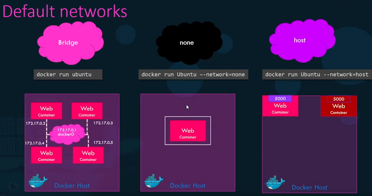
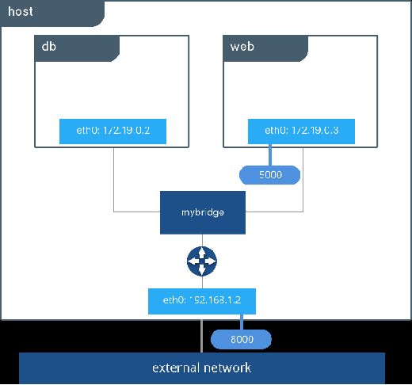
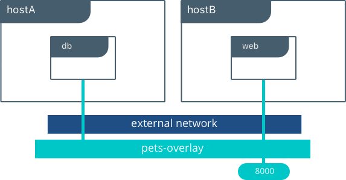
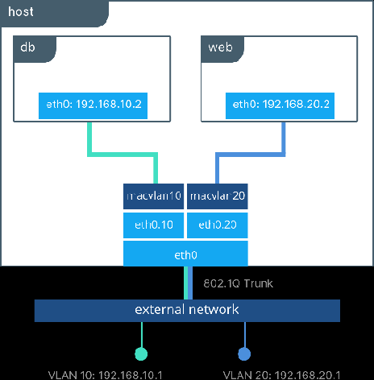

# Networks
Created Dienstag 07 Januar 2020

[Homepage](https://docs.docker.com/network/)

Bridge
------
Default is to attach to bridge docker0. Docker0 is not recommended for production. Create a user-defined bridge.

Host
----
Directly attached to the host network. 

Overlay
-------

macvlan
-------

None
----
Attached to no network. Used in conjunction with a custom network driver.
Is not available to swarm services.

