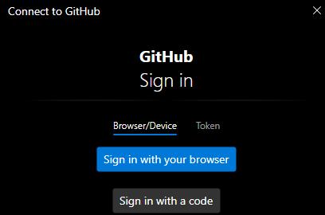

# Create a new repository with existing files
Created Sonntag 19 Mai 2024

Change to repository directory:
``$ cd <Repository>``

Initialize repository:
``$ git init``

Add the existing files:
``$ git add .``

Create isnital commit:
``$ git commit -m "Initial commit"``

Check staged files
``$ git status``

Connect with remote repository on Github:
``$ git remote add origin <URL>``
URL:	Can be found at the top of the bare repository.

Change to branch and force-move the name **master** to the new name **main**:
``$ git branch -M main``

Push local repository to Github:
``$ git push -u origin main``
Opens a Connect to Github window (on Windows)

Select your preferd login method.
Upload happens.
Check status with:
``$ git status``

