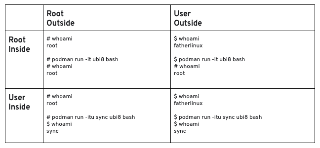
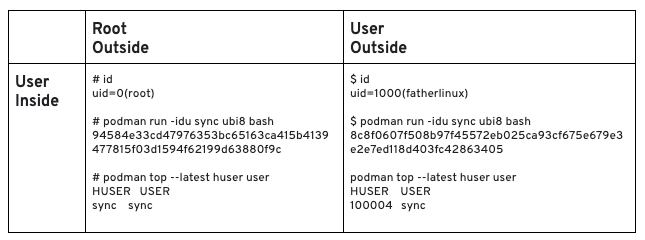

# rootless
Created Dienstag 14 Juli 2020

Run container and in-container process as non-root user.

Root and non-root, outside and inside
-------------------------------------

User mapping
------------

File system
-----------
ATTENTION: Newly rootless started containers chown all root ownd files in the image to the mapped id.

IP address
----------
Rootless container don't get an IP address. They are directly connected to a host NIC.

