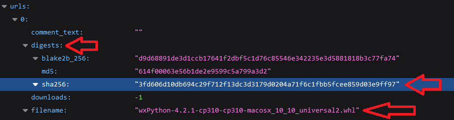

# Check hash of downloaded wheel
Created Montag 19 Juni 2023

A Python package can include multiple packages. So you have to download them to take the hashes by wheel.

Download wheel(s) to current directory:
C:\> py -m pip download <SomePackage name>

Use a hash view tool (e.g. SHA256/512 script in DOpus -> Add column) or pip to see the hashes of the wheel.
[Pip](https://pip.pypa.io/en/stable/cli/pip_hash/):
C:\> py -m pip hash <Local path to wheel>
E.g.:
C:\> py -m pip hash .\wxPython-4.2.1-cp311-cp311-win_amd64.whl

Get hash from package on PYPI ([JSON API](https://warehouse.pypa.io/api-reference/json.html)). Enter the following URL in the browser ([src](https://www.peterdebelak.com/blog/finding-python-package-hashes-via-api/)):
<https://pypi.org/pypi/$package/$version/json>
E.g.:
<https://pypi.org/pypi/wxPython/4.2.1/json>

Browse to URLS and look for the digest of the specific wheel filename:

