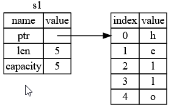
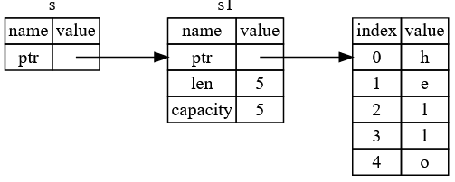

# Ownership
Created Mittwoch 09 Oktober 2019

Scope
-----
{} -> after the end bracket } a function called *drop()* is automatically called to **deallocate** memory.

Variable
--------
Each variable is a separate storage space/structure **on stack**. That also includes a vector to a memory space (memory on heap).

Scalars
-------
[Simple datatypes](https://doc.rust-lang.org/book/ch03-02-data-types.html): integer, float, boolean, character (4 bytes), compound (array, tupple)
All have **fixed sizes**.
All are stored **on the stack**.
let x = 5 // Allocating space on stack
let y = x // Allocating space on stack and coping value
Copying of [array](https://doc.rust-lang.org/std/primitive.array.html) depends on the members datatype. E.g [string, string, ...] musst be cloned.

Vector
------
Concist of an organization unit (variable) **on the stack** and the struct data on the heap, referenced by the variable.
The variable is the bookkeeper. Something like a specialized struct. Consists of a pointer to heap, length and max. capacity (memory size on heap).

let s1 = String::from("hello"); // Allocating space on stack for the reference and space on the heap  for the data
let s2 = s1; // Allocating space on the stack and moving ownership to the new variable. s1 is invalidated. Deleted from stack. Called moving.
function(s1) // Moved ownership to function variable.
s1 = function() // Moved ownership from function variable to upper scope.

### Coping data
let s2 = s1.clone(); // complete copy of variable and data.

Reference
---------
Defined by &.
Only one mutable reference is possible (borrowable).
Mutable can't be mixed with immutable in the same scope.
let r = &s // read only
let r1 = &mut s // mutable reference
let r2 = &mut s // not possible

