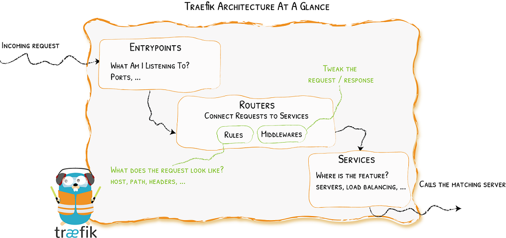

# Concept
Created Freitag 10 Juli 2020

Traffic comes in through entrypoints

The traffic comes in from the **entrypoints**. The **routers** grab a request based on a specific rules (matching) tweak and send the request forward to the service. The **service** knows where to (server/application) send the request.

