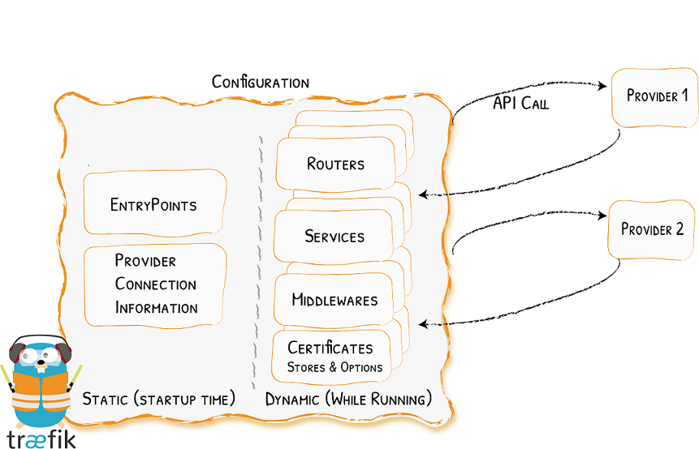

# Configuration
Created Freitag 10 Juli 2020

* [Providers](https://docs.traefik.io/providers/overview/) discover the services that live on your infrastructure (their IP, health, ...)
* [Entrypoints](https://docs.traefik.io/routing/entrypoints/) listen for incoming traffic (ports, ...)
* [Routers](https://docs.traefik.io/routing/routers/) analyse the requests (host, path, headers, SSL, ...)
* [Middlewares](https://docs.traefik.io/middlewares/overview/) may update the request or make decisions based on the request (authentication, rate limiting, headers, ...)
* [Services](https://docs.traefik.io/routing/services/) forward the request to your services (load balancing, ...)

Workflow
--------

1. Define a provider in the static configuration.
2. Set if necessary an entrypoint (listener) in the static configuration.
3. Set a route to a service based on a matching rule in the dynamic configuration.
	1. Configure a middleware.
4. Define the service -> receiving server/application in the dynamic configuration..

