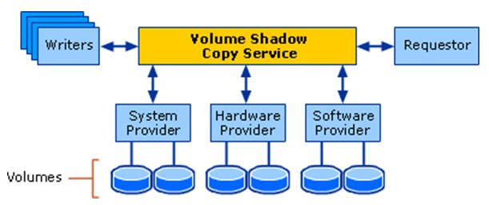

# Volume Shadow Copy (VSS)
Created Freitag 10 Januar 2020

[Homepage](https://docs.microsoft.com/en-us/windows-server/storage/file-server/volume-shadow-copy-service)

Can create snapshots/point-in-time copies. It supports via writer the online backup of application data.

Architecture
------------

Shadow Copy providers
---------------------

### Microsoft Software Shadow Copy provider 1.0
Default Windows VSS provider to create shaow copies. It uses [COW](../../../Glossary/COW.md) to create shatow copies.

### Windows VSS writers/In-Box VSS Writers
[List](https://docs.microsoft.com/en-us/windows/win32/vss/in-box-vss-writers?redirectedfrom=MSDN)

